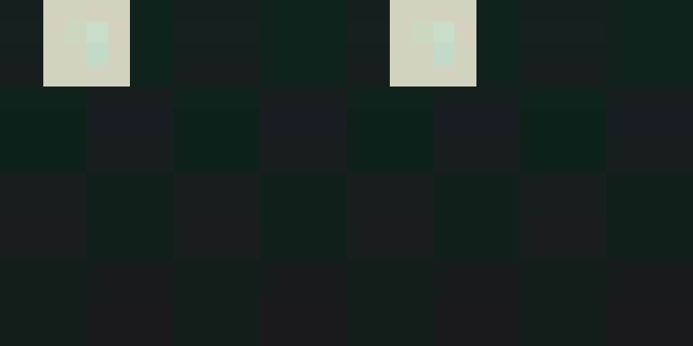
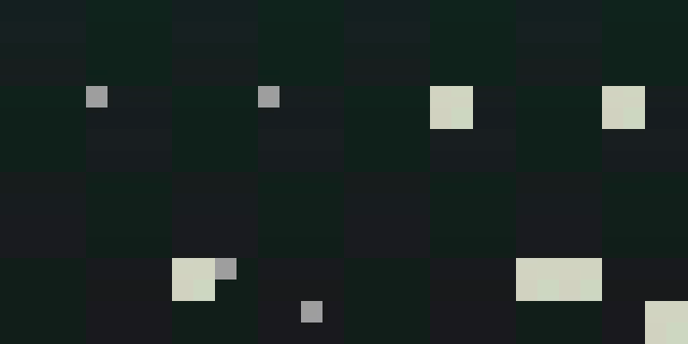
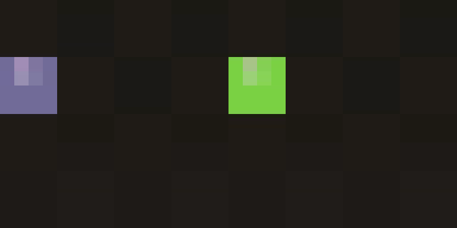
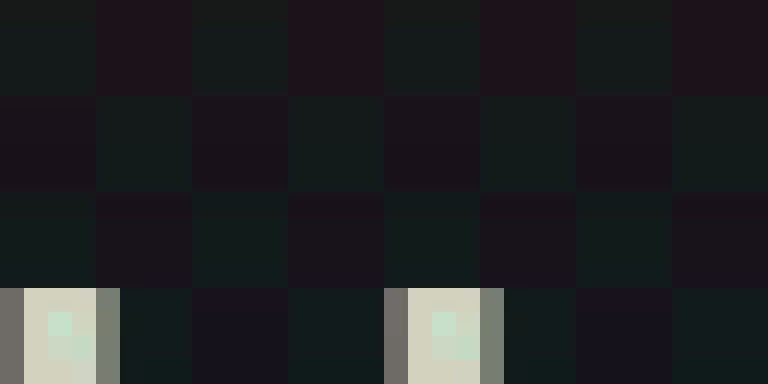

## BDH-CQ (wip)

Implementation of <a href="https://arxiv.org/abs/2608.09888">BDH-CQ: In-Context Learning with Recurrent Latent Reasoning</a>, proposed by Pathway Research

## Install

```bash
$ pip install bdh-cq
```

## Usage

```python
import torch
from bdh_cq import BDH

model = BDH(
    dim = 512,
    num_tokens = 20_000
)

ids = torch.randint(0, 20_000, (2, 1024))

logits = model(ids) # (2, 1024, 20_000)
```

For recurrent latent reasoning, wrap the model and pass an interleaving of
token chunks and latent reasoning steps:

```python
from bdh_cq import BDH, BDHReasoningWrapper

model = BDH(
    dim = 512,
    num_tokens = 256
)

wrapper = BDHReasoningWrapper(model)

prompts = torch.randint(0, 256, (1, 64))
answers = torch.randint(0, 256, (1, 32))

# tensor stages are ingested, int stages are latent reasoning steps - any interleaving

loss, logits, memories = wrapper(prompts, 8, answers, return_loss = True, return_memory = True)

loss.backward()

# generate an answer

answer = wrapper.generate(prompts, 8, num_tokens = 32, stop_token = 0)
```

## Video extension (research)

An in-repo experiment reframes video generation as the same **ingest → relax →
render** protocol: a shot is an ARC-style task whose "grid" is a frozen-VAE
latent volume, demos write the shot grammar into `S`, the query still frame
seeds `H_0`, and a learned decode head reads the answer volume out. Everything
here is research scaffolding — `pip install bdh-cq` still ships only the
`bdh_cq/` package. Design of record: [`docs/BDH_CQ_VIDEO_PLAN.md`](docs/BDH_CQ_VIDEO_PLAN.md),
handoff + per-family status: [`docs/HANDOFF_SPRITE_ICQ.md`](docs/HANDOFF_SPRITE_ICQ.md).

The synthetic sprite oracles (`bdh_cq/video_tasks.py`) are the CPU-testable
sanity for "can ICQ bind a demo rule into `S` and apply it to a new query".
Each `BDHVideoReasoningWrapper` decode mode is auto-routed by family
(`--decode {shift,copy,pan}`). Clips below are **held-out** (a task family
seen in the demos, a fresh unseen instance at query time): **left = model
prediction, right = ground truth**, 22 frames at 128², FakeVAE round-trip,
~804k-param `protocol` model on CPU, shown 3× and looped.

| family | decode | held-out |
|---|---|---|
| `identity` | `copy` | ✅ `lastL1` 0.002 |
| `stamp_copy` | `copy` (attention-copy) | ✅ `lastL1` 0.016 |
| `recolor` | `copy` | ✅ `lastL1` 0.020 (soft gate — see handoff doc) |
| `translate` | `shift` + `--query_cue_frames 9` | ✅ `lastL1` 0.023 |

<table>
<tr>
<td align="center"><b>identity</b><br></td>
<td align="center"><b>stamp_copy</b><br></td>
</tr>
<tr>
<td align="center"><b>recolor</b><br></td>
<td align="center"><b>translate</b><br></td>
</tr>
</table>

`translate` without the query cue (direction learned, magnitude short — the
query's speed is not observable in one still frame) and the overfit train-query
reference:

<p align="center">


</p>

The source `.mp4`s (and per-step evals) are in each `logs/recon_*/` run
directory; `docs/media/` keeps the standout ones.

Reproduce (a few seconds each on CPU):

```bash
uv run pytest tests/test_video_icq.py tests/test_video_tasks.py   # ~90 checks, FakeVAE, no MiniMax-H3
uv run python train_video_icq.py --family stamp_copy --vae fake --device cpu \
  --scale protocol --overfit False --steps 120 --wandb False \
  --recon_dir logs/recon_stamp_copy
# -> logs/recon_stamp_copy/heldout.mp4  (left = pred, right = GT)
```

Not yet passing: `pan` / `translate_pan` — the FakeVAE latent bilinear warp
floors at `lastL1` ~0.04–0.10 vs the 8/255 gate even with the true motion
vector, a decode-fidelity ceiling rather than a reasoning one. The fix is the
real H3 VAE, which needs a CUDA host; the decode ops (`composite_pan`,
`composite_translate_pan`) are already written and oracle-tested. See the
handoff doc for the analysis and the exact run command.

## Citations

```bibtex
@misc{engdahl2026bdhcq,
    title   = {BDH-CQ: In-Context Learning with Recurrent Latent Reasoning},
    author  = {Björn Engdahl and Adrian Kosowski and Jan Chorowski and Zuzanna Stamirowska and Przemysław Uznański and Junlin Jiang and Rohan Phadke and Remigiusz Kinas and Richard Zhong},
    year    = {2026},
    eprint  = {2608.09888},
    archivePrefix = {arXiv},
    primaryClass = {cs.NE},
    url     = {https://arxiv.org/abs/2608.09888}
}
```

```bibtex
@misc{kimiteam2026attentionresiduals,
    title   = {Attention Residuals},
    author  = {Kimi Team and Guangyu Chen and Yu Zhang and Jianlin Su and Weixin Xu and Siyuan Pan and Yaoyu Wang and Yucheng Wang and Guanduo Chen and Bohong Yin and Yutian Chen and Junjie Yan and Ming Wei and Y. Zhang and Fanqing Meng and Chao Hong and Xiaotong Xie and Shaowei Liu and Enzhe Lu and Yunpeng Tai and Yanru Chen and Xin Men and Haiqing Guo and Y. Charles and Haoyu Lu and Lin Sui and Jinguo Zhu and Zaida Zhou and Weiran He and Weixiao Huang and Xinran Xu and Yuzhi Wang and Guokun Lai and Yulun Du and Yuxin Wu and Zhilin Yang and Xinyu Zhou},
    year    = {2026},
    eprint  = {2603.15031},
    archivePrefix = {arXiv},
    primaryClass = {cs.CL},
    url     = {https://arxiv.org/abs/2603.15031},
}
```

```bibtex
@misc{knupp2026depthrecurrentattentionmixturesgiving,
    title   = {Depth-Recurrent Attention Mixtures: Giving Latent Reasoning the Attention it Deserves},
    author  = {Jonas Knupp and Jan Hendrik Metzen and Jeremias Bohn and Georg Groh and Kristian Kersting},
    year    = {2026},
    eprint  = {2601.21582},
    archivePrefix = {arXiv},
    primaryClass = {cs.AI},
    url     = {https://arxiv.org/abs/2601.21582},
}
```

```bibtex
@inproceedings{chakrabarti2026poly,
    title   = {Poly-attention: a general scheme for higher-order self-attention},
    author  = {Chakrabarti, Sayak and Pitassi, Toniann and Alman, Josh},
    booktitle = {International Conference on Learning Representations (ICLR)},
    year    = {2026}
}
```
