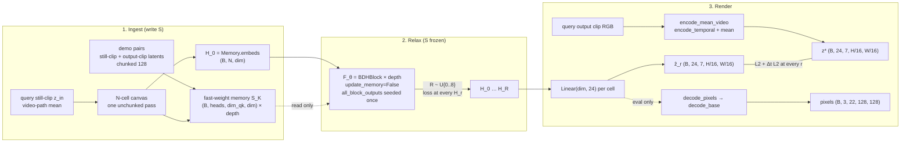

# BDH-CQ video generation — first experiment plan

| Field | Value |
|---|---|
| **Title** | BDH-CQ video generation: ground truth as the load-bearing decision |
| **Author** | TBD |
| **Date** | 2026-09-09 |
| **Status** | As-built. Mixed AVAL 1000-step run proved appearance (PSNR 31) not motion (every eval CLIP_FAIL). Motion path: max-Δ windows, `decode(z*)` gate, still+\(\mathrm{cumsum}(u)\). Train on **msi CUDA**, not the Mac. |
| **Codebases** | `bdh-cq` (this repo). Real-VAE work runs on **msi** (`johndpope@msi.local`). |
| **Paper** | BDH-CQ, arXiv:2608.09888 |
| **Host (answered 2026-09-08)** | NVIDIA RTX PRO 4000 Blackwell, 24467 MiB. `--h3-root` and `--vae-path` defaults below. |

This document specifies the first experiment that treats video generation as BDH-CQ's ingest → relax → render protocol, not as a DiT with a different attention kernel. The load-bearing decision is **what counts as ground truth**. Everything else (workspace shape, loss, eval probes, PR order) is a consequence of that choice.

---

## Overview

Video generators today denoise tens of thousands of packed VAE tokens with a deep bidirectional score network on every sampling step. MiniMax-H3's trainable generator is exactly that object: `MiniMaxH3DiTModel` / `MiniMaxH3Transformer3DModel`, 50 layers, hidden 5376, 56 heads × 128, AdaLN-heavy ~33B (`FL2VA/transformer/config.json`). That forward pass is out of scope as the thing we train. At most it is film-out, and in v0 it is not even that.

BDH-CQ (arXiv:2608.09888), as implemented in `bdh_cq/bdh_cq.py` and exercised by `bdh_cq/icq.py`, has three objects:

1. **Recurrent memory** \(S_t = U_\theta(S_{t-1}, D_t)\). Context writes a task into fast weights. \(\theta\) is frozen at inference; \(S\) is the in-context program.
2. **Latent workspace** \(H_0 = E_\theta(x^\star, S_K)\), then \(H_{r+1} = F_\theta(H_r, S_K)\) with \(S\) held at \(S_K\) during reasoning (`update_latent_memory=False`, paper eq. 3, default in `BDHReasoningWrapper`).
3. **Decode** \(\hat{y} = G_\theta(H_R)\).

The video analogue is ingest → relax → render:

- Ingest demo pairs (and the query still-clip) into \(S\) once. **No task-name token, no LLM, no text embeddings.** Demos are the spec, as in `icq.task_prompt`.
- Iterate an \(N\)-cell scene workspace \(H\) for \(R\) latent steps (test-time effort, sampled at train like `figure7.py`). **Every** step, including \(H_0\), is a decode target. \(N = 7\cdot(H/16)\cdot(W/16)\). Default film canvas is **portrait 512×288 → \(N=4032\)**. 128×128 (\(N=448\)) is pytest-only.
- Decode \(H_r\) through a learned `Linear(dim, 24)` into VAE cells; frozen \(G\) is eval-only.

**v0 ground truth (the decision):** in-context query output clips, encoded with the **frozen H3 VisualVAE posterior mean** via `encode_temporal` + `.mean` — never `encode_base` / `encode_videos` / `.sample()`. Content is two families, same protocol, **no op-id**:

1. **Sprites** — synthetic deterministic oracles (`bdh_cq/video_tasks.py`). Composition cliff = `translate_pan`.
2. **AVAL talking heads** — 124 expression clips of one actor (`bdh_cq/aval_clips.py`). Each task is 3 other expressions as demos + one held-out clip as query. Action names never enter the net; the query still is the cue.

The trainable model never sees pixels in the loss. \(G\) stays frozen. Teacher hidden states from the 33B Omni-Transformer are rejected.

This is implemented in `bdh-cq` plus FakeVAE (and the frozen H3 VAE on msi). It does not train the 33B DiT.

---

## As-built architecture (2026-09-09)

What the repo actually contains. Stale “448-cell v0” / “associative is PR6” language below is historical; this section wins.

```text
raw mp4  ~6 s @ 24 fps
        │  best_motion_window (max consecutive-frame L1), length 22 or 39
        ▼
pixels  (B, 3, T, H, W)   T ∈ {22,39}  16-aligned H×W
        │  drop if source tL1 < 1/255
        ▼  FakeVideoVAE  or  encode_temporal + .mean
z*      (B, 24, T', H/16, W/16)   T'(22)=7, T'(39)=12
        │  drop if is_still_clip(decode(z*))     # G-gate
        ├─ demos, chunk 128 ──► S
        └─ query still z_in, one unchunked pass ──► H_0
        R ~ U{0..8}, S frozen
        u_r = Linear(dim, 24)(H_r) reshaped to z's grid
        ẑ_r[:,:,0] = z_in[:,:,0]
        ẑ_r[:,:,t] = z_in[:,:,0] + cumsum(u_r[:,:,1:], t)    # integrate_u
        L = mean_r [ L2(ẑ_r, z*) + L2(Δẑ_r, Δz*) ]
eval    decode_pixels(ẑ_R) → clip. CLIP_FAIL if tL1 < 1/255
```

| Piece | File | Status |
|---|---|---|
| Sprite oracles (7 families) | `bdh_cq/video_tasks.py` | done |
| FakeVAE + real VAE loader | `bdh_cq/video_vae.py` | done. Dynamic 16-aligned `(H,W)`. `PORTRAIT_H,W = 512, 288` |
| Latent probes | `bdh_cq/video_probes.py` | done |
| Wrapper | `bdh_cq/video.py` `BDHVideoReasoningWrapper` | done. `n_cells` from `z` shape, not hardcoded 448 |
| Associative omit-self attn | `bdh_cq/bdh_cq.py` `_omit_self_linear_attn` | done. `q @ cumsum(kᵀv)` when `N>512` and the `N×D×E` buffer ≤ 2 GiB; else materialized \(S\times S\) (ARC tests) |
| AVAL ICQ | `bdh_cq/aval_clips.py` + `aval_manifest.json` | done. 124 clips. **Max-Δ window**, not fixed t=24. 22 then 39 if G-gate empty |
| Motion gate | `encode_aval_library(..., gate_decode=True)` | drop source-still and `decode(z*)` still. Cache `latents_{tag}_{H}x{W}_f{T}_motion.pt` |
| Average velocity | `integrate_u` in `video.py` | \(H_0\) still; \(\hat z = z_{\text{still}} + \mathrm{cumsum}(u)\). t=0 locked |
| Rank-k motion token | `--motion_rank k` | IMF-style \(m\in\mathbb{R}^k\); \(u_t=\sum_i A_i(z_0)\,m_i\,\phi_t\). Not DiT/Qwen. `--motion_rank 0` is the old full Linear |
| Trainer | `train_video_icq.py` | `--clip_frames 22` retries 39 if library < 4. `--gate_decode` |
| GT probe | `scripts/probe_gt_motion.py` | sprite translate control + AVAL 22/39 G-roundtrip |
| Fetch | `scripts/fetch_aval_clips.py` | Cache `data/aval_clips/proc_{H}x{W}/`. Recut reads **raw** mp4 |

**Ingredients (one task).** Not “3 videos.” Three **before/after** pairs + one query still:

```text
[IN] raster(z_demo_in) [OUT] raster(z_demo_out) [EOS]   × 3   # chunked 128, writes S
[CANVAS_START]  raster(z_query_in)   # full still-volume, no empty_cell
```

Markers `PAD, IN, OUT, EOS, CANVAS_START` are the only `token_embed` rows. VAE cells go `Linear(24, dim)` as floats. **No Qwen, no CLIP text, no `{smile, translate}` embedding.**

**AVAL packing (one actor, no labels).** Demos are other expressions of the same face so \(S\) binds identity. The window is the **max pixel-Δ** slice of length 22 (legal \(T'=7\)) or 39 (\(T'=12\)), not a fixed start at frame 24. Query still = first frame of that window (already in the expression). Idle→labelled-smile needs an op-id; we do not do that. A clip whose source window or `decode(z*)` is still (`tL1 < 1/255`) is dropped from the library — matching a still \(z^\star\) cannot produce a clip.

**Train host.** `johndpope@msi.local`, NVIDIA RTX PRO 4000 Blackwell, 24467 MiB, conda `2.13.0+cu130`. Mac MPS OOM’d at \(N=4032\) (~20 GiB watermark). Do not train portrait on the laptop.

```bash
# on msi
cd ~/Documents/GitHub/bdh-cq
conda activate base
PYTHONUNBUFFERED=1 python scripts/probe_gt_motion.py --vae h3 --device cuda --n-aval 8
# then, only on clips that survive the G-gate:
PYTHONUNBUFFERED=1 python train_video_icq.py \
  --family aval --steps 80 --scale tiny --overfit=False \
  --device cuda --vae h3 --height 512 --width 288 \
  --clip_frames 22 --gate_decode --allow_raw --eval_every 20
```

**Playback vs generate.** Frozen \(G\) emits **24 fps**. A v0 clip is 22 frames ≈ 0.92 s. Generation throughput is a separate number (unmeasured on CUDA as of this revision).

---

## Background & Motivation

### What BDH-CQ actually trains

`icq.py` is not a language-model trainer that happens to have extra steps. The protocol is:

1. Serialize ARC-style demo pairs and a query input (`task_prompt`). There is **no** family-name token; demos are the spec.
2. Ingest the prompt into fast-weight memory \(S\) in chunks of `CHUNK_SIZE = 128` (`ingest` / `ingest_hiddens`). `Memory.embeds` after ingest is **the last chunk only** (`bdh_cq.py` returns `Memory(tokens_seen + seq_len, tokens, next_memories)`).
3. Iterate the query's last hidden `R` times with \(S\) frozen (`BDHReasoningWrapper`: `latent = memories.embeds[..., -1:, :]`).
4. Teacher-force the query **output** grid (`task_answer`). **Every latent step** is projected to the first answer token (`bdh_cq.py:534–535`); every answer position predicts the next. Plus next-token CE over the prompt (`train_loss`).

`figure7.py` samples \(R \sim \mathcal{U}\{0,\ldots,8\}\) at train and sweeps \(R \in \{1,2,4,6,8\}\) at infer. Accuracy is supposed to climb with effort. `tasks.py` §6.2 families (propagation, copy, order, nesting) and §6.3 `COMPOSITION_TASKS` (atomic motif ops vs `reflect_relocate` / `rotate_relocate` / `swap_relocate`) exist because **composition is the capability cliff** (paper table 4).

Exact-match, cell accuracy, and dimension-correct (`cell_stats`) are the metrics. `order` is the trap: the output is a `1 × n` strip, not the input canvas (`test_order_output_is_color_sequence`).

### What H3 actually is, that we will not train

H3-Base packs text (Qwen3-VL-32B hidden states, `text_dim = 5120`), visual latents (VisualVAE f16t4d24, then patch `1 × 2 × 2` → 32× spatial into the transformer), and audio latents (AudioVAE 32 kHz → 40 Hz, 32 ch stereo) into one Omni-Transformer that jointly predicts video and audio latents (`MiniMax-H3/README.md`, `FL2VA/transformer/config.json`).

The VisualVAE is a different object, and it is the only H3 component v0 is allowed to use:

| Piece | Class | File | Role in v0 |
|---|---|---|---|
| Wrapper | `MiniMaxH3VideoVAE` | `FL2VA/video_vae/minimax_h3_video_vae.py` | class + `from_config` knobs; **do not** `from_pretrained` on this checkout (no `source/model.safetensors`) |
| Implementation | `AutoencoderKLLegacy` | `FL2VA/video_vae/klvae.py` | frozen encoder / decoder |
| Encoder | `EncoderFCN3D` | `FL2VA/video_vae/vae_cnn.py` | causal 3D CNN, GT source |
| Decoder | `ViT3DDecoder` | `FL2VA/video_vae/vae_vit.py` | frozen \(G\), 36 layers, 32×64 |
| Posterior | `DiagonalGaussianDistribution` | `FL2VA/video_vae/vae_module.py` | **use `.mean`, not `.sample()`, for GT** |
| Processor | `VAEProcessor` | `FL2VA/video_vae/vae_processor.py` | ImageNet pixel norm, length align |
| Audio VAE | `MiniMaxH3AudioVAE` → `DacAudioVAE` | `FL2VA/audio_vae/` | **not v0** |
| Omni-Transformer | `MiniMaxH3DiTModel` | `FL2VA/transformer/config.json` | **out of scope** |
| Text encoder | Qwen3-VL-32B (`hidden_size=5120`) | `FL2VA/text_encoder/config.json` | **not v0** |

VisualVAE compression, from `FL2VA/video_vae/source/config.json`:

- `space_down = [2, 2, 2, 2, 1, 1]` → `vae_ratio = 16`
- `time_down = [1, 2, 2, 1, 1, 1]` → `vae_ratio_t = 4`
- `z_channels = embed_dim = 24`
- `causal_encoder = true`, `causal_decoder = false`, `use_vit_decoder = true`
- `pixel_norm_type = "imagenet"` (mean `(0.485, 0.456, 0.406)`, std `(0.229, 0.224, 0.225)` in `normalize.py`)

Production temporal chunking, from `FL2VA/video_vae/config.json` (the knobs `from_pretrained` *would* pass; we pass them in `load_visual_vae`):

- `vae_clip_length = 17`
- `vae_token_drop = 3`
- `tokens_chunk_size = ceil(17 / 4) = 5`
- `token_overlap = 2`, `frame_overlap = 5`

`VAEProcessor.get_latent_length` then yields, for a clip that survives `get_suitable_video_length` (chunk-granularity trim):

\[
T' = \left\lfloor \frac{T_{\text{used}} - 5}{17} \right\rfloor \cdot 5 + 2
\]

Valid used lengths are \(17k + 5\) for \(k \ge 1\): **22, 39, 56, …** frames. The shortest production clip is **22 frames → \(T' = 7\)**.

A 17-frame encode through `encode_temporal` with `token_drop=3` does produce \(T' = 2\), but `get_suitable_video_length(17)` raises on trim. v0 clips are 22 frames so they are legal on the production length path.

**GT encode does not call `encode_videos` / `encode_images` / `encode_base`.** Those three always end in `DiagonalGaussianDistribution(moments).sample()` (`klvae.py:1240`). v0 reuses `encode_videos` *preprocessing* (`get_suitable_video_length`, spatial crop, ImageNet `transform_tensor`) and then `encode_temporal` → `.mean`. See `encode_mean_video` below.

After the encoder, H3's DiT further patchifies `1 × 2 × 2` (`FL2VA/transformer/config.json` `patch_size`). **v0 does not.** \(G\) is the VAE decoder, which consumes unpatched `(B, 24, T', H', W')`.

### Pain points this experiment is for

- Swapping softmax for linear attention inside the 33B DiT would test a kernel, not BDH-CQ. Out of scope.
- Pixel / latent L2 on web video can be won by copying the first frame. Without composition oracles we will not know if \(S\) bound a task.
- ARC exact-match does not transfer. We need a metric suite that plays the role of pass@1 / cell accuracy / dimension-correct, on a set small enough that `figure7.py`-style effort sweeps finish in minutes to hours.

---

## Goals & Non-Goals

### Goals

- Decide and implement **one v0 ground-truth tensor** and loss that an engineer can code from this document.
- Wire BDH via a thin `BDHVideoReasoningWrapper` so the training protocol is ingest → \(R\) latent steps with \(S\) frozen → decode, matching `icq.train_loss` / `figure7.py` (every step is a valid answer; `all_block_outputs` spans steps).
- Keep \(G\) = frozen H3 VisualVAE decoder (`decode_base` via `decode_pixels`). Keep the encoder frozen as the GT factory.
- Prove test-time effort: train with \(R \sim \mathcal{U}\{0,\ldots,8\}\), sweep \(R\) at infer, report whether composition metrics are monotone in \(R\).
- Ship a synthetic oracle family whose composed task (walk+pan) is the cliff, in the spirit of `tasks.COMPOSITION_TASKS`, with integer `demo_levels` / `test_levels`.
- Stay short-sequence in **time** (22 frames). Spatial default is portrait 512×288, \(N=4032\), with associative omit-self attention. 128×128 / \(N=448\) remains the pytest canvas.

### Non-Goals

- Training, LoRA-ing, or distilling `MiniMaxH3DiTModel` / the 33B Omni-Transformer.
- Replacing H3 SDPA with `BDHBlock`.
- Audio generation or joint audio-video latents in v0.
- Qwen3-VL-32B as the v0 text encoder. Also: **no learned op/level token as the default** (that would bypass demo-binding).
- Web-scale video, 768p, 2K, 15 s, or the packed ~30k–90k DiT-token regime.
- Flow-matching / denoising objectives.
- Softmax attention, AdaLN-DiT blocks, or a new VAE.
- Changing the ARC path (`icq.py`, `tasks.py`, `figure7.py`) except where a shared helper is strictly cleaner.

---

## Key Decisions

### 1. Ground truth for v0 (load-bearing)

**Default: option H protocol × option F content × option A representation.**

| Axis | Choice | Meaning |
|---|---|---|
| Protocol | **H** — in-context demonstration pairs | Demos bind a transform into \(S\); GT is the **query output clip**, not next-frame LM. **No op id.** |
| Content | **F** — synthetic deterministic oracles | Exact renderer GT; composition cliff is observable; figure-7 sweeps fit in hours |
| Representation | **A** — frozen VisualVAE posterior **mean** | Lives in \(G\)'s code space; \(G\) stays frozen; pixels are eval-only |

Concretely, the answer tensor is

```text
z* = DiagonalGaussianDistribution(encode_temporal(preprocessed_clip)).mean
   # (B, 24, 7, 8, 8)
```

`encode_base` at `klvae.py:1240` always `.sample()`s; v0 must not call it (nor `encode_videos` / `encode_images`, which call it). Loss is **unmasked** latent L2 over all \(B\cdot 24\cdot 7\cdot 8\cdot 8\) cells plus a temporal-difference term so first-frame copy cannot win. \(G\) is not in the training graph.

**Why this and not the other combinations**

- **A alone (real-video VAE latents, next-frame or full-clip reconstruction)** trains appearance in the right code space but does not test demo-binding or composition. Promotion, not v0.
- **B (decoded pixels)** puts \(G\) (a 36-layer 2048-wide `ViT3DDecoder`) in the graph or forces an expensive eval-as-train loop. Rejected for v0; used as an eval metric.
- **C (AR in latent time)** is what you do when \(T'\) is 100. v0 has \(T' = 7\). One-shot clip workspace. Promotion when clips get longer. (The mixer is still *causal in raster order*; that is not option C. See KD3.)
- **D (AudioVAE 40 Hz)** is a second frozen \(G\) and a second GT. Rejected for v0; see Open Questions if that should move up.
- **E (teacher hidden states from the 33B)** requires the DiT weights, \(O(S^2)\) forwards, and a 5376-d hidden that is a score-network state, not a scene. Rejected / deferred.
- **F without H** (oracle clips, but trained as reconstruction / next-frame) can be solved by memorizing renderer statistics. We would not know if \(S\) bound anything.
- **G (flow / depth / pose / ID) as the sole target** trains a vision system, not a generator. Aux probes only.
- **H with pixel GT** (demos in pixels, loss in pixels) is B without a frozen \(G\) that can actually invert our \(H\). If \(G\) is frozen, pixel GT and VAE-latent GT are **not the same thing**.
- **H with an op-id token** lets a 6–8M model ignore \(S\) and become a supervised multi-task generator. That collapses table 4. Default is demos-only.

**Promotion path** (add when the current loss saturates, do not swap):

1. **v0 (this doc):** F×H×A. Synthetic ICQ, latent L2 + Δt, composition probes, demos-only.
2. **v0.1:** turn on aux G probes (optical flow, identity embedding) as **metrics first**, then as small aux losses if latent L2 is being gamed. Optional ablation: demos-only vs op-only vs both.
3. **v1:** option A on a small licensed real-video set, still ICQ-style if we can construct pairs (same scene, two motions); otherwise full-clip latent reconstruction with the first-frame-copy probe kept.
4. **v1.1:** option C, AR over latent frames, when \(T' \gg 7\).
5. **v2:** option D audio, only after visual composition is real.
6. **Never v0, maybe never:** option E.

### 2. Frozen \(G\) is the VisualVAE decoder, not the DiT

Eval calls **one** API: `decode_pixels(vae, z) → (B, 3, 22, 128, 128)` in `[0, 1]`, which unwraps to `AutoencoderKLLegacy.decode_base(z, frame_num=22)` then `VAEProcessor.revert_tensor`. `decode` / `decode_temporal` are internals of `decode_base`; do not call them from eval or train. Encoder is the GT factory. Neither is trained. The 33B transformer is not loaded. Weights enter through `load_visual_vae(--h3-root, --vae-path)`, not `from_pretrained`.

### 3. Workspace \(H\) is a 448-token canvas, not last-token Coconut

`BDHReasoningWrapper` today sets `latent = memories.embeds[..., -1:, :]` (`bdh_cq.py:517`). That is correct for ARC, where \(G_\theta\) is an AR LM head and the answer is a token string of unknown length (`order` is `1 × n`).

It is the wrong \(H\) for a frozen clip decoder. A single `dim`-vector cannot be \(G\)'s input; \(G\) wants `(B, 24, 7, 8, 8)`. Expanding one vector to 448 cells hides the scene in a learned CNN/ViT readout we would then be training instead of BDH.

**Locked \(H_0\) contract** (do not follow `icq.ingest` for the canvas):

1. Ingest **demos only** in 128-token chunks with `update_memory=True`. After this, `Memory.embeds` is the last demo chunk (≤128) — **not** \(H_0\).
2. Ingest the **full 448-cell canvas in one unchunked pass** (`update_memory=True`) so `Memory.embeds` is exactly \(H_0\) of shape `(B, 448, dim)`.
3. `reason(memories, steps)` takes that `Memory` and **must not** accept a raw un-forwarded canvas. It reads `H = memories.embeds` with `embeds.shape[-2] == 448`.

There is no 384-vs-448 option. The workspace is always \(N\) cells in raster order `(t, h, w)`. **As-built (option 1):** \(H_0 = \mathrm{raster}(z_{\text{query in}})\) — the full still-volume, not \(t=0\) plus `empty_cell`. `to_latent` emits a velocity volume \(u\); film-out is \(\hat z = \mathrm{integrate\_u}(u, z_{\text{in}})\) so \(t=0\) stays the query still and later times are \(z_{\text{in}}[:,:,0] + \mathrm{cumsum}(u[:,:,1:])\). That is the discrete MeanFlow identity on this canvas, not a noise→data ODE.

**RoPE:** v0 uses the existing 1-D `RotaryEmbedding` over that raster. 3-D RoPE over `(t, h, w)` is a follow-up (Open Question 8), not v0.

**The mixer stays causal.** `BDHBlock` applies `tril(-1)` (`bdh_cq.py:209–214`). This is **not** a bidirectional scene workspace and it is **not** Coconut (the Linear head reads all 448 cells; last token is not privileged). Raster `(t,h,w)` means \(t=0\) cells predict the first latent frame from the first-frame init plus frozen \(S\); later cells see earlier raster positions in the local pass. The only path for early cells to see later ones is retrieval from \(S\) written during the unchunked canvas ingest (memory retrieval is not causally masked). During reasoning `update_memory=False`, so subsequent \(H\) updates do not enter \(S\).

This is a deliberate wrapper fork, not a silent change to ARC. New type: `BDHVideoReasoningWrapper` in `bdh_cq/video.py`.

### 4. Text is demos-only, not Qwen and not an op lookup

A ~6–50M BDH does not get to condition on 5120-d Qwen states without a projection that will dominate learning. More importantly, a closed-set `nn.Embedding` of `{translate, pan, translate_pan, ...}` plus a level id would let the model ignore \(S\) and become a supervised multi-task generator. ARC `task_prompt` has no task-name token.

**v0 default: markers + latents only.** Cheap frozen text encoders (CLIP-text, T5-small) and an op/level lookup are a **v0.1 ablation axis** (demos-only vs op-only vs both), reported as extra rows in the figure-7 table, not the silent default.

### 5. \(R\) schedule, every-step decode, eq. 3, residual list

Match `figure7.py`: `MAX_REASONING_STEPS = 8`, `reasoning_steps = rng.randint(0, MAX_REASONING_STEPS)` at train, sweep `{1, 2, 4, 6, 8}` at infer. `update_memory=False` during latent steps. Token ingest (demos + canvas) writes \(S\) (`update_memory=True`).

Two wrapper behaviors that the video path must copy:

1. **Every latent step is a valid answer**, including \(R=0\) = `Linear(H_0)`. `icq.train_loss` projects *each* of the R steps (`bdh_cq.py:534–535`). Video applies \(\mathcal{L}_{\text{rec}}+\mathcal{L}_{\Delta}\) at \(H_0, H_1, \ldots, H_R\) and means them. Applying L2 only to \(H_R\) makes the R-sweep non-monotone for a reason the paper does not have: \(H_3\) on an 8-step trajectory was never a decode target.
2. **`all_block_outputs` is seeded once and mutated across steps.** Wrapper sets `all_block_outputs = [H]` then passes the same list into every `bdh` call so `AttentionResidual` spans depth × reasoning (`bdh_cq.py:412`: identity residual collapses at 8 steps). If the list is `None`, each pass starts a *local* list and the residual does not cross steps.

### 6. Model scale and train defaults

Two scales, both using the existing **depth-recurrent** `BDH` (one `BDHBlock` applied `depth` times, `bdh_cq.py:299`):

| Name | kwargs | When |
|---|---|---|
| **protocol** | `figure7.py`: `dim=256, depth=4, heads=4, dim_qk_heads=1024, attn_residual=True, attn_residual_depth_bias_distance=1` | First train PR, CPU/MPS, prove the loop |
| **v0 GPU** | `dim=512, depth=8, heads=8, dim_qk_heads=4096, rotary_dim=64, attn_residual=True, attn_residual_depth_bias_distance=1` | After protocol is green |

`icq.MODEL_KWARGS` is `dim=384, depth=4, heads=4, dim_qk_heads=2048` (~few million params; the block is shared). v0 GPU is still ~6–8M in the recurrent block (`to_qk` + `proj_up` + `proj_out` ≈ 3 × 512 × 4096). Untying one block per depth (~8×) is a scale-up knob, not the default.

`num_tokens` is markers only: `PAD, IN, OUT, EOS, CANVAS_START` (8 is enough). Continuous latents bypass `token_embed` via the existing floating-point branch in `BDH.forward` (`bdh_cq.py:337`). After concatenating `token_embed(markers)` with `patch_in(z)`, apply `bdh.post_embed_norm` once (integer ARC ingest gets this via the embed path; a raw float call skips it).

**Optimizer / schedule** (copy `figure7.py` for protocol-scale; do not silently reuse 800 steps on GPU):

| Knob | Protocol-scale | v0-GPU |
|---|---|---|
| optimizer | AdamW `lr=1e-3`, `weight_decay=0.1` | same |
| grad clip | 1.0 | 1.0 |
| steps | 800 | **8000** (knob 5k–20k) |
| batch | 1 task / step | 4 if VRAM allows, else 1 |
| device | `cpu` (laptop repo / FakeVAE pytest) | **`cuda` on msi** (RTX PRO 4000 Blackwell, 24467 MiB; ~22 GiB free at probe). Not a cluster. |
| \(R\) | `randint(0, 8)` | same |
| family mix | uniform over the seven families; `translate_pan` **only** at `demo_levels` during train | same |

### 7. Canvas is dynamic; default is portrait 9:16. Associative attention is in v0.

User lock (2026-09-08): **larger than 128², portrait, size not hardcoded.**

Pixel \((H,W)\) is an oracle argument. Constraints from `VAEProcessor._align_to_total_patch_size`: \(H\) and \(W\) must be multiples of `latent_patch_size * vae_ratio`. `klvae.py` defaults `latent_patch_size=1`, `vae_ratio=16` → **multiples of 16**. (If a loader ever sets `latent_patch_size=2`, that becomes 32; v0 asserts `% 16 == 0` and tests 16-alignment.)

\[
H',W' = H/16,\; W/16,\quad T'=7 \text{ (22-frame production clip)},\quad N = 7\cdot H'\cdot W'
\]

**Default v0: portrait 9:16 at \(H=512,\; W=288\).** Latent grid \(32\times 18\), \(N=4032\) cells. 4× the 128² pixel count; sprite 24 px is 1.5 latent cells tall — still a blob in film-out, but the **workspace** has 4.5× more spatial tokens than 8×8, which is what motion probes need. Exact 9:16 (\(288/512=0.5625\)).

| Preset | \(H\times W\) (pixels) | Aspect | \(H'\times W'\) | \(N\) cells |
|---|---|---|---|---|
| `portrait` (default) | 512×288 | 9:16 | 32×18 | 4032 |
| `portrait-768` | 768×432 | 9:16 | 48×27 | 9072 |
| `square-256` | 256×256 | 1:1 | 16×16 | 1792 |
| `landscape` | 288×512 | 16:9 | 18×32 | 4032 |

`video_tasks.Task` takes `height`, `width` (not a single `CANVAS`). `encode_mean_video` accepts any 16-aligned spatial size at `T=22`; it must **not** assert `CANVAS=128`. `H_0` length is `N`, not 448. Raster remains `(t, h, w)` with `h` the **pixel-height** axis (portrait → more rows).

**Associative attention is implemented** in `_omit_self_linear_attn` (`bdh_cq.py`). Causal `q @ cumsum(kᵀv)` (omit-self via a right-shifted prefix) when `seq > 512` and the `N×D×E` buffer is ≤ 2 GiB. Otherwise materialized \(S\times S\) (ARC tests, 128² video tests). Portrait \(N=4032\) takes the associative path.

128×128 remains a **unit-test** size, not the training default. Measured film-out at 128: 28.9 dB overall / 16.9 dB on the sprite (blob). Larger canvas improves latent resolution of the sprite; it does not magically restore pixel edges.

---

## Proposed Design

### Objects and data flow



### Train-step sequence (one ICQ task)

```mermaid
sequenceDiagram
  participant Or as Oracle renderer
  participant E as encode_mean_video
  participant W as BDHVideoReasoningWrapper
  participant G as decode_pixels

  Or->>Or: sample params, render 3 demo pairs + query at 128² × 22
  Note over Or,E: inputs are 22-frame stills of first_frame; outputs are full clips
  Or->>E: encode_mean_video each clip (never encode_base)
  E-->>W: z_demo_in, z_demo_out, z_query_in, z*  all (24, 7, 8, 8)

  loop demos, chunks of 128
    W->>W: ingest [IN] z_demo_in [OUT] z_demo_out [EOS] (update_memory=True)
  end
  W->>W: unchunked canvas pass, raster(z_query_in) full still-volume
  Note over W: H_0 = memories.embeds shape (B, 448, dim); S = S_K
  W->>W: all_block_outputs = [H_0]
  W->>W: loss += L(Linear(H_0), z*)

  loop r = 1..R
    W->>W: H ← BDH(H, S_K, update_memory=False, all_block_outputs=same list)
    W->>W: loss += L(Linear(H), z*)
  end
  W->>W: loss = mean over r = 0..R

  opt W: eval every N steps
    W->>G: decode_pixels(ẑ)
    G-->>W: pixels for PSNR / probes
  end
```

Paper mapping:

| Paper | Code today (ARC) | v0 video |
|---|---|---|
| \(D_t\) context | demo grids + query input tokens (no family id) | demo `(z_in, z_out)` latents + query still-clip (no op id) |
| \(S_t = U_\theta(S_{t-1}, D_t)\) | `BDHBlock` memories, `combine_memories` = sum | same `Memory.fast_weight_memories` |
| \(H_0 = E_\theta(x^\star, S_K)\) | last token of query ingest | 448-token canvas after **unchunked** canvas ingest; `embeds.shape[-2]==448` |
| \(H_{r+1} = F_\theta(H_r, S_K)\) | `update_latent_memory=False` loop on 1 token; every step → first answer token | same flag, loop on 448 tokens; every \(H_r\) → `z*` |
| \(\hat{y} = G_\theta(H_R)\) | `to_logits` + AR `generate` | `Linear(dim, 24)` then frozen `decode_pixels` (eval) |
| Answer / GT | discrete output-grid tokens, CE | `z*` VAE mean, unmasked L2 + Δt |
| Effort | `figure7.py` `R ~ U\{0..8\}` | identical, loss at every \(r\) including 0 |

### VAE tensor shapes (derived, not invented)

Pixel video in: `(B, 3, T, H, W)` float in `[0, 1]`, \(T=22\), \(H=W=128\). ImageNet-normalized **inside** `encode_mean_video`.

`EncoderFCN3D` spatial: four stride-2 spatial downsamples → \(H' = W' = 128/16 = 8\).

Temporal, production length math:

- 22 frames is a legal `get_suitable_video_length`.
- `get_latent_length(22) = 7`.
- `encode_temporal` emits moments `(B, 48, 7, 8, 8)` (`double_z`, `2 * embed_dim` via `quant_conv`).
- **GT** `z* = DiagonalGaussianDistribution(moments).mean` which is `moments[:, :24]`. Do not call `.sample()`.

**One encode path for every video-shaped tensor.** Do not mix `encode_images` / `process_image=True` / `trim_code(z, 1)` with the clip path. A single-frame image encode is a different causal/padding trajectory than `encode_temporal` of a 22-frame clip, so even `identity` (output = repeat first frame) would have `canvas t=0` ≠ `z*[:, :, 0]`. v0 therefore:

- Query / demo **inputs** = `repeat(first_frame, T=22)` encoded with `encode_mean_video` → `z_in` `(B, 24, 7, 8, 8)`.
- Query / demo **outputs** = the 22-frame oracle clip, same function → `z*` / `z_out`.
- `z_first := z[:, :, :1]` from a video-path encode. Copy-detector uses `repeat(z*[:, :, :1], T=7)`, never a 64-cell image latent against a 448-cell clip.
- `encode_images` is reserved for a later still-conditioning experiment.

`latents_mean` / `latents_std` in `FL2VA/video_vae/config.json` (24-vectors) are DiT-side normalization. They are **not** applied inside `AutoencoderKLLegacy.encode/decode`. v0 GT is the raw encoder mean, because that is what `decode_base` consumes. If a later experiment talks to the DiT, apply those stats then — not before.

**Eval decode.** `ViT3DDecoder` unpacks each latent cell with `patch_size_t=4`, so 7×4 = 28 frames internally (`vae_vit.py:361–364`). Production `decode_base` → `decode_temporal` for \(T'=7\) uses `num_chunks = 1`, splits that 28-frame ViT output with `frame_pre_padding=3` and overlap, and yields **22** frames (`frame_num=22`). Call `decode_pixels` only; do not treat the raw 28-frame unpack as the eval tensor.

Patch `1 × 2 × 2` is a DiT input packing. Ignoring it, token counts are:

| Canvas | Frames | \(T' \times H' \times W'\) | \(N\) VAE cells | `BDHBlock` \(N^2\) / head | v0? |
|---|---|---|---|---|---|
| 64×64 | 22 | 7×4×4 | 112 | 12k | protocol debug |
| **128×128** | **22** | **7×8×8** | **448** | **200k** | **yes** |
| 256×256 | 22 | 7×16×16 | 1792 | 3.2M | scale-up |
| 512×512 | 22 | 7×32×32 | 7168 | 51M | no, need associative attn |
| 768×768, ~15 s | ~345 used | ~102×48×48 | 235k (58k after 1×2×2) | impossible | H3's problem, not ours |

22 frames @ 24 fps ≈ 0.92 s of content. That is enough for translate / pan to be visible and not enough to pretend we are doing 15-second generation.

### Architecture internals

**Ingest tokens (all float, dim-wide, then one norm).** Markers (`IN, OUT, EOS, CANVAS_START`) come from `token_embed`. VAE cells: `rearrange(z, 'b c t h w -> b (t h w) c')` then `Linear(24, dim)` (`patch_in`). Concatenate on the sequence axis. **Then** `tokens = bdh.post_embed_norm(tokens)` so markers and patches share the scale integer ingest gets in `BDH.forward`. Always call `bdh` with floats so VAE cells never index `token_embed`. RoPE is 1-D over the ingest / canvas raster (`rotary_dim=64` on the first 64 of each QK head).

**Demo ingest (chunked).** For each of 3 demos:

```
[IN] raster(z_in)  [OUT] raster(z_out)  [EOS]
```

`z_in` and `z_out` are both `(24, 7, 8, 8)` video-path means (~448 + 448 cells plus 3 markers ≈ 899 tokens / demo). Chunk at `CHUNK_SIZE = 128` with `update_memory=True`, same as `icq.ingest`. After the last demo chunk, `Memory.embeds` is **not** the canvas.

**Canvas construction (unchunked, this is \(H_0\)).**

```
canvas = raster(z_query_in)   # all T'×H'×W' cells; still-clip encode, no empty_cell
seq = [CANVAS_START] + canvas                               # optional marker; if present, reason() drops it and keeps the 448
```

Forward this sequence in **one** `bdh(..., update_memory=True)` call. Assert `memories.embeds.shape[-2] == 448` (strip the marker if used). That tensor is \(H_0\).

**Latent steps.**

```python
# BDHVideoReasoningWrapper.reason(memories, steps) — memories.embeds is H_0
H = memories.embeds
assert H.shape[-2] == N_CELLS  # 448
all_block_outputs = [H]        # seed once; mutate across steps
zs = [self.to_latent_volume(H)]
for _ in range(steps):
    _, memories = self.bdh(
        H, memories=memories,
        return_memory=True, return_logits=False,
        update_memory=False,                      # eq. 3
        all_block_outputs=all_block_outputs,      # same list
        total_reasoning_iterations=steps,
    )
    H = memories.embeds
    zs.append(self.to_latent_volume(H))
# train: mean L(z_hat, z*) over zs (len = steps+1, includes R=0)
# infer: return zs[-1]
```

```python
def to_latent_volume(self, H):
    return rearrange(self.to_latent(H), 'b (t h w) c -> b c t h w',
                     t=LATENT_T, h=LATENT_HW, w=LATENT_HW)
```

`to_logits` is unused for the video loss. Keep it so the same `BDH` still runs ARC tests.

**`Memory` layout unchanged:** `namedtuple('Memory', ('tokens_seen', 'embeds', 'fast_weight_memories'))`. Each layer memory is `(B, heads, dim_qk, dim)` for order-1 (`BDHBlock`: `einsum('b h n d, b n e -> b h d e', k, v)`). `combine_memories` is still addition.

**Attention residual** on, tied, with `attn_residual_depth_bias_distance=1`, matching `figure7.py`. After `steps` reasoning iterations at `depth=D`, `len(all_block_outputs) == 1 + steps * D`. Test that; it is the residual contract.

### Loss (implementable)

Let \(u_r = \mathrm{Linear}(H_r)\), \(\hat{z}_r = \mathrm{integrate\_u}(u_r, z_{\text{in}})\), \(z^\star\) the gated query output. Shapes \((B, 24, T', H', W')\) with \(T'\in\{7,12\}\). No cell mask.

\[
\hat z[:,:,0] = z_{\text{in}}[:,:,0],\qquad
\hat z[:,:,t] = z_{\text{in}}[:,:,0] + \sum_{k=1}^{t} u[:,:,k]
\]

\[
\mathcal{L}_{\text{rec}}(\hat{z}) = \|\hat{z} - z^\star\|_2^2
\qquad
\mathcal{L}_{\Delta}(\hat{z}) = \|(\hat{z}_{t+1}-\hat{z}_t) - (z^\star_{t+1}-z^\star_t)\|_2^2
\]

\[
\mathcal{L} = \frac{1}{R+1}\sum_{r=0}^{R}\left(\mathcal{L}_{\text{rec}}(\hat{z}_r) + \lambda_\Delta \mathcal{L}_{\Delta}(\hat{z}_r)\right),\quad \lambda_\Delta = 1.0
\]

If \(u=0\), \(\hat z\) is a still. The 1000-step mixed run (no integrate, ungated 22-frame t=24 windows) reached PSNR 31 with **every** eval CLIP_FAIL: \(G(\,z^\star\,)\) itself was a still (`gt tL1 ~ 0.002`). Extra steps / native res / text do not fix that. Gate + recut + integrate is the motion path.

**Filter vs loss vs architecture (do not ossify).** Pixel CLIP_FAIL and max-Δ windows are **library admission**, not a layer in \(F_\theta\). `reason()` / `train_loss` never see `is_still_clip`. Identity and sprite `translate` stay in the mix (`--sprite_mix`, default 0.25) so AVAL-only survivors cannot become a hardcoded “always talk” prior.

| Layer | Use | Do not |
|---|---|---|
| Library | max-Δ window; log `src_tL1`, `latent_vs_still`, `decode_tL1`; `--admit decode` (film-out) or `latent_or_decode` | drop identity; feed tL1 into the net |
| Train | \(\mathrm{MSE}(z,\hat z)+\lambda\mathrm{MSE}(\Delta z,\Delta\hat z)\) on every \(H_r\) | pixel L1 / LPIPS in graph |
| Arch | \(H\) is \(T'\times H'\times W'\); `integrate_u` locks \(t=0\) | op-id, DiT/ConvRot hidden, AdaLN-on-tL1 |

**Gated 22-frame table (msi, 124 AVAL, admit=decode).** keep **61** / drop **63**. Probe n=8: f=22 G-moving 6/6; f=39 G-moving 3/6 — do not hardcode 39. 200-step tiny run: GT tL1 ~0.004–0.008 (clip), pred tL1 ~0.013 **smear not target expression**. Appearance mismatch is capacity / mixed ICQ, not a reason to bake the gate into \(F\).

Optional cosine on spatially mean-pooled \(\hat{z}_R\) vs \(z^\star\) as a logging metric, not the train loss (cosine on the volume is too weak; the model can match mean appearance and ignore motion).

**Do not** add an AR next-token CE on rasterized cells in v0. That reintroduces option C and a first-frame-copy language-model cheat.

**Do not** put `ViT3DDecoder` under `loss.backward()`.

No prompt next-token CE analogue is required: ingest tokens are continuous. If we want a regularizer that the model actually read the demos, add an aux L2 that reconstructs demo **output** latents from a short readout of \(S\) after ingest, weighted 0.1. Not needed to start.

### What ability this trains

| Term | Ability |
|---|---|
| \(\mathcal{L}_{\text{rec}}\) | appearance of the query output in VAE code space |
| \(\mathcal{L}_{\Delta}\) | motion; blocks static copy of \(t=0\) |
| ICQ demos in \(S\), no op id | bind the *transform*, not a labelled task |
| loss at every \(H_r\) | every effort in the \(R\)-sweep is in distribution |
| walk vs pan vs walk+pan probes | the table-4 cliff |

Identity is trained only to the extent the oracle preserves the sprite. That is enough for v0; a real ID embed (CLIP / ArcFace) is a v0.1 probe.

---

## API / Interface Changes

No change to `BDH`, `BDHBlock`, `BDHReasoningWrapper`, `icq.py`, or `tasks.py` required for v0, except possibly exporting `Memory` (already used). New files:

| File | Responsibility |
|---|---|
| `bdh_cq/video_tasks.py` | oracles, `generate(seed) → {train, test}` of `(level, first_frame, clip)`; `demo_levels` / `test_levels`; `task_at_level` analogue |
| `bdh_cq/video_vae.py` | `FakeVideoVAE`; `load_visual_vae(h3_root, vae_path)` shim (not `from_pretrained`); `encode_mean_video`, `decode_pixels`. **No** `encode_mean_image` in v0 |
| `bdh_cq/video_probes.py` | family probes + copy-detector (GT tests, no BDH) |
| `bdh_cq/video.py` | `VIDEO_MODEL_KWARGS`, patch in/out, `BDHVideoReasoningWrapper`, `train_loss`, `ingest_task` |
| `figure7_video.py` | effort sweep on held-out oracle levels |
| `tests/test_video_tasks.py` | oracle invariants (translate vs pan, composition, levels) |
| `tests/test_video_vae.py` | `test_gt_is_mean_not_sample` (skip without weights); FakeVAE shape `(B, 24, 7, 8, 8)` |
| `tests/test_video_icq.py` | protocol shapes, \(S\) frozen, residual list growth, `embeds.shape[-2]==448`, post_embed_norm, loss backward |

Packaging: add an optional extra so ARC installs stay lean.

```toml
# pyproject.toml
[project.optional-dependencies]
video = ["diffusers", "torchvision", "safetensors", "pillow"]
```

**Host defaults (msi, verified 2026-09-08).** Do not assume `MiniMaxH3VideoVAE.from_pretrained(h3_root)` finds weights.

| Flag / env | Default on msi |
|---|---|
| `--h3-root` / `MINIMAX_H3_ROOT` | `/home/johndpope/Documents/GitHub/MiniMax-H3` (Python: `FL2VA/video_vae/`, `source/config.json` only — **no** `source/model.safetensors`) |
| `--vae-path` / `MINIMAX_H3_VAE` | `/run/media/johndpope/2TB/minimax-h3-nvfp4/vae/minimax_h3_video_vae_fp16.safetensors` (4.9G, Comfy-Org `Comfy-Org/MiniMax-H3` layout). Duplicate: `/run/media/johndpope/2TB/Fizgig/models/minimax_h3_video_vae_fp16.safetensors` |
| `--device` | `cuda` on msi; FakeVAE pytest stays `cpu` in the laptop repo |
| Audio VAE (not v0) | `/run/media/johndpope/2TB/minimax-h3-nvfp4/vae/minimax_h3_audio_vae_fp32.safetensors` (578M) |

H3 Relay (`/home/johndpope/Documents/GitHub/h3-relay`) is a Comfy serving pack; `MODELS.md` points at those Comfy-Org VAE files and **does not** redistribute weights.

The Comfy-Org single fp16 file is **not** `FL2VA/video_vae/source/model.safetensors`. `MiniMaxH3VideoVAE.from_pretrained` (`minimax_h3_video_vae.py:68–113`) joins `source_path / source_safetensors_path` and raises `FileNotFoundError` on this checkout. v0 loads via an explicit shim (below).

Tests import `FakeVideoVAE` with **no** MiniMax-H3 on `sys.path` and without the `video` extra.

Critical interfaces:

```python
# bdh_cq/video_vae.py
LATENT_CH = 24
VAE_SPATIAL = 16
VAE_TEMPORAL = 4          # documented compression; T' is NOT T/4
CLIP_FRAMES = 22          # production-legal
LATENT_T = 7              # VAEProcessor.get_latent_length(22)
CANVAS = 128
LATENT_HW = CANVAS // VAE_SPATIAL   # 8
N_CELLS = LATENT_T * LATENT_HW * LATENT_HW  # 448

DEFAULT_H3_ROOT = "/home/johndpope/Documents/GitHub/MiniMax-H3"
DEFAULT_VAE_PATH = (
    "/run/media/johndpope/2TB/minimax-h3-nvfp4/vae/"
    "minimax_h3_video_vae_fp16.safetensors"
)

def load_visual_vae(h3_root: str | Path, vae_path: str | Path) -> nn.Module:
    """Load frozen AutoencoderKLLegacy from *split* code + Comfy fp16 weights.

    Do NOT call MiniMaxH3VideoVAE.from_pretrained(h3_root): that expects
    {h3_root}/FL2VA/video_vae/source/model.safetensors, which is absent.

      1. Import AutoencoderKLLegacy from {h3_root}/FL2VA/video_vae
         (add that dir to sys.path; do not import transformer / text_encoder).
      2. Instantiate from source/config.json with the production knobs
         MiniMaxH3VideoVAE.from_pretrained would have passed
         (clip_length=17, token_drop=3, tiling flags from
         FL2VA/video_vae/config.json).
      3. state = safetensors.torch.load_file(vae_path)
      4. Strip a leading `model.` / `vae.` prefix if present; fail loud
         (`strict=True`) if keys still mismatch. Do not silently skip.
      5. model.eval(); requires_grad_(False). Return the AutoencoderKLLegacy
         (or MiniMaxH3VideoVAE wrapping it).

    Calibration on msi: SSH + `--h3-root` + `--vae-path` as in the host table.
    """

@torch.no_grad()
def encode_mean_video(vae, video_ncthw: Tensor) -> Tensor:
    """(B, 3, 22, 128, 128) in [0, 1] -> (B, 24, 7, 8, 8) posterior mean.

    Algorithm (real VAE). Do NOT call encode_base / encode_videos / encode_images.
      1. Unwrap to AutoencoderKLLegacy (load_visual_vae, not from_pretrained).
      2. Reuse encode_videos preprocessing:
         used = processor.get_suitable_video_length(T)  # 22
         spatial _align_to_total_patch_size + _crop_to_align(..., is_video=True)
         processor.transform_tensor  # ImageNet
      3. moments = model.encode_temporal(video)          # (B, 48, 7, 8, 8)
      4. return DiagonalGaussianDistribution(moments).mean  # (B, 24, 7, 8, 8)
         (equivalently moments[:, :24])
    FakeVideoVAE: spatial avg-pool 16×, temporal resample 22→7 (not 22/4),
    frozen random 3→24 conv; same output shape. Deterministic.
    """

@torch.no_grad()
def decode_pixels(vae, z: Tensor) -> Tensor:
    """(B, 24, 7, 8, 8) -> (B, 3, 22, 128, 128) in [0, 1].
    Real: AutoencoderKLLegacy.decode_base(z, frame_num=22) then processor.revert_tensor.
    decode_temporal is internal to decode_base. Fake: invert the FakeVideoVAE pool.
    """

class FakeVideoVAE(nn.Module):
    """No H3 import. encode_mean_video / decode_pixels as above. Always T'=7."""
```

```python
# bdh_cq/video.py
VIDEO_MODEL_KWARGS = dict(
    dim=512, depth=8, heads=8, dim_qk_heads=4096,
    rotary_dim=64, attn_residual=True,
    attn_residual_depth_bias_distance=1,
)
PROTOCOL_MODEL_KWARGS = dict(
    dim=256, depth=4, heads=4, dim_qk_heads=1024,
    attn_residual=True, attn_residual_depth_bias_distance=1,
)

class BDHVideoReasoningWrapper(Module):
    def __init__(self, bdh: BDH, to_latent: Linear | None = None): ...
    def ingest_task(self, task_latents, n_demos=3) -> Memory:
        """Demos chunked 128; canvas one unchunked pass.
        Returns Memory with embeds.shape == (B, 448, dim)."""
    def reason(self, memories: Memory, steps: int) -> Tensor:
        """memories.embeds is H_0. Does not accept a raw canvas.
        Train path returns the list of ẑ_r; infer returns ẑ_R."""
    def train_loss(self, task_latents, steps: int, lambda_dt: float = 1.0) -> Tensor:
        """Mean of L_rec+L_Δ over r = 0..steps."""
```

---

## Data Model Changes

No database. On-disk cache is optional.

### Oracle families (v0 set)

Mirror `tasks.py`: each family `sample`s layout params once per seed, then `render(level)` produces `(first_frame, output_clip)`. Demos draw `demo_levels`, query draws `test_levels`. Deterministic given `seed`. Provide `task_at_level(cls, seed, level, n_demos=3)` like `icq.task_at_level`: demos from `demo_levels`, query at exactly `level`.

**Shared geometry (locked):**

| Constant | Value |
|---|---|
| canvas | 128×128 RGB uint8, numpy blit (no Blender) |
| frames | 22 |
| sprite | 24×24 filled rectangle; optional 2–3 interior colored blobs so identity is not a single RGB |
| margin | sprite origin sampled so the *entire* 24×24 stays on-canvas at every frame of the *hardest* test level |
| background | vertical low-frequency RGB lerp **plus** a 32 px checker (pan must be visible at 8×8) |
| motion | integer **pixels / frame**, axis-aligned or 8-neighbor unit `(dx, dy)` stored in `params` |
| edges | **no wrap**; clip/stop: if the next step would put any sprite pixel off-canvas, hold last legal pose |
| n_demos / n_tests | 3 / 1 at train; eval may use `n_tests=2` like `figure7.py` |

Inputs that are “a first frame” are stored as that RGB frame and **encoded** as `repeat(first_frame, T=22)`.

| Family | Analogue | `demo_levels` | `test_levels` | Motion / effect |
|---|---|---|---|---|
| `identity` | control | `(0, 0)` | `(0, 0)` | output = repeat(first_frame, 22). Sprite at random legal `(x, y)`. |
| `translate` | walk | `(1, 2)` | `(3, 4)` | sprite += `level * (dx, dy)` px/frame. `(dx, dy) ∈ \{\pm1,0\}^2 \setminus \{(0,0)\}\) sampled in `params`. Camera / bg **static**. |
| `pan` | camera | `(1, 2)` | `(3, 4)` | bg phase shifts `level * (px, py)` px/frame; sprite **world-static** (screen position moves opposite the pan). Same 8-neighbor unit in `params`. |
| `translate_pan` | `MotifOp(compose_relocate=True)` | `(1, 1)` | `(3, 3)` | translate **and** pan, independent units in `params`. **Train:** only `level ∈ demo_levels`. **Holdout eval:** `task_at_level(..., level=3)` with pan sign **negated** relative to demos (easy demos, hard opposite-sign query). |
| `seed_extend` | `Propagation` | `(1, 2)` | `(3, 4)` | 16 px-tall bar on the left; grows `level` px/frame to the right; clip at edge. Distractor color off the bar row, not extended. |
| `stamp_copy` | `Copy` | `(1, 2)` | `(3, 4)` | `level` = #anchors. 16×16 sprite; 8×8 gray anchors on frame 0; output stamps sprite at each anchor, static. |
| `recolor` | `Swap` | `(1, 1)` | `(1, 1)` | sprite fill A → B; no motion. Mapping is in `params`, revealed only by demos. |

**Composition cliff:** this *is* table 4. Atomic `translate` / `pan` train at their full `demo_levels`. Composed `translate_pan` is in the train mix **only** at speed 1. Held-out query is speed 3 with opposite-sign pan. A translate-only model must fail that probe (PR5 eval script, not pytest).

`identity` exists so we can see a task the model **should** solve by copying. If identity is unsolved, the rest of the suite is not yet about composition.

Skip a pixel `order` (1×n strip of colors) in v0; output-dimension construction is an ARC-specific failure mode and fights the fixed VAE grid. Revisit as a "emit a strip image" family later.

### Dataset size

On-the-fly, like `tasks.Task.generate`. No web video. The 800 protocol-scale steps each draw one fresh seed (like `figure7.py`); that is the schedule. The “2 000 seeds × 7 families” figure is only an **optional encode cache** upper bound, not a train epoch:

- 2 000 seeds × 7 families × (3 demos + 1 query) ≈ 56k clip encodings.
- Each `z` is `24 * 7 * 8 * 8 * 4 B = 21.5 KB` (fp32) or 11 KB (fp16).
- Full cache ≈ 0.6–1.2 GB. Fits on disk next to the repo, gitignored.

PR1–PR3 can skip the cache and encode online (`FakeVideoVAE` is cheap). Cache real-VAE latents before the figure-7 sweep.

### Alignment with `icq.py`

| ARC (`icq.py`) | Video v0 |
|---|---|
| `task_prompt` = demos + query input grid tokens, **no family id** | demos `(z_in, z_out)` + query still `z_in` + canvas, **no op id** |
| `task_answer` = query output grid tokens + EOS | `z*` `(24, 7, 8, 8)` of query output clip |
| CE on discrete tokens; every latent step → first answer token | unmasked L2+Δt on every \(H_r\), \(r=0..R\) |
| `generate` AR until EOS | one-shot `to_latent`; length is fixed |
| `cell_stats` exact equality | see Metrics |
| `max_answer_tokens` unknown shape | \(T',H',W'\) known from VAE; dimension-correct is a sanity assert |
| `demo_levels` / `test_levels` / `task_at_level` | same, integer speeds in the table above |

The "answer" is **not** a token string. It is the latent volume. Teacher-forcing an AR answer stage after reasoning is option C and is not v0.

---

## Metrics (the role of pass@1 / cell accuracy / dimension-correct)

Paper §6.2 uses exact-match, cell accuracy, and dimension-correct. Video cannot exact-match pixels. Use this mapping:

| Paper | Video v0 metric | How | Won by first-frame copy? |
|---|---|---|---|
| dimension-correct | `z.shape == (24, 7, 8, 8)` after decode-head | assert | n/a |
| cell accuracy | `1 / (1 + MSE(ẑ, z*))` | primary train signal | **yes**, if static |
| cell accuracy (motion) | MSE on \(\Delta_t\) | train + report | **no** |
| exact / pass@1 | **oracle probe pass** | family-specific, **latent-grid default** | only on `identity` |
| pass@2 | two temperatures / two \(R\) seeds | optional, later | |
| FVD / rFVD | **not v0** | needs real video distribution | |

**Default probes live in latent space** (8×8 grid, \(T'=7\)). Pixel-space numbers (centroid L2 < 2 px, PSNR > 30 dB, NCC τ) are **outputs of the calibration script**, not merge gates. If frozen-\(G\) recon of GT clips fails those pixel probes, keep latent probes and/or bump canvas (Open Question 5).

Latent-grid probes (PR1, no BDH):

- `identity`: MSE(\(\hat{z}\), \(z^\star\)) below a bound fitted on FakeVAE (always) and on real-VAE GT recon (when weights exist).
- `translate`: sprite centroid trajectory on the 8×8 grid vs oracle; bg phase of a masked non-sprite region must be ~0.
- `pan`: bg phase vs oracle; sprite centroid **world** position constant (centroid + pan).
- `translate_pan`: **both** probes must pass. This is the cliff.
- `stamp_copy`: each anchor cell matches the sprite patch.
- `seed_extend`: filled extent along the bar row within 1 latent cell of target.
- `recolor`: mean of sprite-region channels closer to target color than to source.

Copy-detector (logging, not a pass@1):  
\(\mathrm{MSE}(\hat{z},\; \mathrm{repeat}(z^\star_{:,:,:1}, T=7))\) vs \(\mathrm{MSE}(z^\star,\; \mathrm{same})\). If these converge on a motion family, the model is stilling.

Report, for each family and each \(R \in \{1,2,4,6,8\}\):

- latent MSE, Δt MSE
- probe pass rate (the pass@1 analogue)
- decoded PSNR / LPIPS against oracle RGB **when real VAE is present** (eval; LPIPS optional)
- **monotone in \(R\)** boolean, like `figure7.py`

Also report the ablation row **only if** someone turns on op-id: demos-only (default) vs op-only vs both.

---

## Alternatives Considered

Each candidate below is specified to the level of a loss function. v0 is H×F×A as decided above.

### A. Frozen H3 VisualVAE latents of real video

- **Tensor:** `(B, 24, T', H', W')` posterior mean from `encode_temporal` after `encode_videos` preprocessing. Frozen encoder. \(T'\) from `VAEProcessor.get_latent_length`. Not `encode_videos` itself (that samples).
- **Loss:** L2 and/or cosine on \(z\); optional Δt L2.
- **Trains:** appearance in \(G\)'s code space; motion only if the data has it and Δt is on. Not demo-binding.
- **Cost:** need a licensed clip set; VAE-encode once; at 128×128×22 this is cheap, at 768p it is not.
- **Failure:** first-frame copy; no composition cliff; licenses. Also: real video at 128×128 is a tiny blurry crop of H3's training domain.
- **Frozen G?** Yes, if GT is the encoder mean. Pixel GT would not match.
- **Verdict:** v1 promotion, not v0.

### B. Decoded pixels

- **Tensor:** `(B, 3, 22, 128, 128)` from `decode_pixels` → `decode_base`.
- **Loss:** RGB L2, LPIPS, maybe a GAN term.
- **Trains:** whatever \(G\) can put on the screen. If \(G\) is in the graph, we are fine-tuning a 36-layer ViT decoder. If \(G\) is not, the loss is detached and the gradient stops at \(\hat{z}\) — which is just a worse-conditioned version of A.
- **Cost:** 36×2048 ViT on every train step if \(G\) is live. At \(N=448\) this is tolerable but pointless.
- **Failure:** \(G\) cannot fix a bad \(H\); LPIPS still copy-able; train/eval mismatch if we then freeze \(G\).
- **Frozen G?** Pixel GT and latent GT diverge the moment \(G\) is frozen. **They are not the same target.**
- **Verdict:** eval metric only (PSNR/LPIPS on `decode_pixels(ẑ)`).

### C. Next-frame vs full-clip latents

- **Next-frame:** AR in \(T'\). Answer tensor is \(z_{t+1}\) given \(z_{\le t}\). Loss L2 per latent frame. \(N\) per step = \(H' W' = 64\).
- **Full-clip:** one-shot \(H\) of 448, loss on the whole volume.
- **Trains:** AR trains local continuation (LM-like). Full-clip trains a scene. Composition (walk+pan over 22 frames) is a clip-level fact.
- **Cost:** AR is 7 teacher-forced steps; full-clip is one. Both fine at \(T'=7\).
- **Failure:** AR averages away the cliff; also the current wrapper's "every latent step predicts the first answer token" becomes "predict latent frame 1", which is almost the first frame.
- **Frozen G?** Yes, if the target is still encoder means.
- **Verdict:** full-clip v0; AR when \(T' \gg 7\). Causal *raster* mixing inside the 448 is not this option.

### D. Joint audio latents

- **Tensor:** H3 AudioVAE, `MiniMaxH3AudioVAE` / `DacAudioVAE`. `encoder_rates = [2,4,4,5,5]`, hop \(= 800\), 32 kHz → 40 Hz, `vae_latent_channels = 32`, stereo as two independent mono encodes (`README`, `FL2VA/audio_vae/metadata.json`). For 22 frames @ 24 fps ≈ 0.92 s → ~37 tokens × 32 ch × 2.
- **Loss:** L2 on audio latents, plus visual.
- **Trains:** lip-sync / soundtrack if the oracle has any; our numpy blit oracles do not.
- **Cost:** second frozen VAE; `DacAudioVAE` in this bundle exposes `decode` but **no public `encode`** (`dac_audio_vae.py` has `encoder`, `mean_proj`, `logs_proj`, no `encode` method). We would write that wrapper ourselves.
- **Failure:** splits the first experiment; silent audio is a free "win".
- **Frozen G?** Yes, separately.
- **Verdict:** not v0. Open Question if it should be v1.

### E. Teacher hidden states from H3 Omni-Transformer

- **Tensor:** activations of `MiniMaxH3DiTModel`, hidden 5376, 50 layers, on packed tokens (VAE latents patchified `1×2×2` plus Qwen states plus audio). A score-network state at some diffusion timestep, not a scene.
- **Loss:** L2 / cosine distill into BDH \(H\).
- **Trains:** imitation of a bidirectional denoiser. That is the design we are not doing.
- **Cost:** 33B weights (safetensors gitignored, not necessarily local), \(O(N^2)\) at \(N \sim 10^4\)–\(10^5\), CFG-distilled checkpoint semantics, AdaLN timestep dependence.
- **Failure:** infeasible on the hardware this experiment is for; even if feasible, we would distill the wrong object.
- **Frozen G?** Distill target is not \(G\)'s code space.
- **Verdict:** reject for v0 and v1. Revisit only if someone has a packed-token dump and a reason to match H3 samples rather than oracle clips.

### F. Synthetic deterministic oracles (content)

- **Tensor:** RGB from a renderer, then (in our default) encoded as A. Could also supervise in RGB (then it becomes B) or in exact sprite metadata (then it becomes G).
- **Loss:** whatever representation we chose; oracles additionally give **exact** probe GT (centroids, pan pixels, colors).
- **Trains:** the paper's capability, composition, with a known cliff.
- **Cost:** numpy blit, microseconds per clip. Dominant cost is VAE encode, cacheable.
- **Failure:** domain gap to photoreal video. That is acceptable: v0 is a protocol + composition test, not Hailuo.
- **Frozen G?** Only if we encode through the frozen encoder (we do).
- **Verdict:** v0 **content**.

### G. Auxiliary structured GT (flow, depth, pose, ID)

- **Tensor:** e.g. RAFT flow `(B, 2, 21, 128, 128)`, DINO/CLIP pooled ID `(B, D)`, optional depth. Frozen off-the-shelf nets.
- **Loss:** L2 on flow of decoded pixels, cosine on ID of sprite crop vs first-frame crop.
- **Trains:** motion / identity **probes**. As a sole target, does not produce a clip \(G\) can decode.
- **Cost:** extra models; flow on 128 is cheap.
- **Failure:** optimizing flow without appearance yields garbage pixels; optimizing ID yields a still.
- **Frozen G?** Aux only.
- **Verdict:** v0.1 metrics, then optional aux losses. Not the sole GT.

### H. In-context demonstration pairs (protocol)

- **Tensor:** query output clip, represented as A (or B). Demos are additional encoded pairs written into \(S\), not into the loss except via whatever they bind. **No op/level token** in the default prompt (ARC does not name the family).
- **Loss:** on the **query** output only, at every reasoning step, analogue of wrapper latent CE (the prompt CE in `icq` is extra; we drop the discrete analogue).
- **Trains:** the actual BDH-CQ objective — bind a transform from demos, apply to a new input. This is not next-frame LM.
- **Cost:** 4× VAE encodes per task (3 demos + query), cached. Each encode is a still-clip or a moving clip, both 22 frames, same function.
- **Failure:** (1) demos too similar to the query — mitigate with `task_at_level` easy demos / hard query. (2) **op-id leak** — default demos-only; op-only vs both is an ablation, not the ship path.
- **Frozen G?** Yes with A.
- **Verdict:** v0 **protocol**.

### Other alternatives not taken

- **Unfrozen VAE.** Turns the project into VAE fine-tuning on toy data. \(G\) would overfit 128×128 sprites and lie about transfer.
- **Last-token Coconut + AR latent cells.** Minimal wrapper change, 448-step AR, copy-friendly, fights frozen clip \(G\). Rejected in Key Decision 3.
- **Shared `BDHReasoningWrapper` with a flag.** Too easy to break ARC tests (`tests/test_icq.py`, `tests/test_bdh_cq.py`). Separate wrapper.
- **Chunk the canvas at 128 like `icq.ingest`.** `Memory.embeds` would be the last 128 cells, and `rearrange(..., t=7, h=8, w=8)` would crash or silently reason over a slice. Rejected in KD3.

---

## Security & Privacy Considerations

- **Threat model:** this is a research trainer on synthetic sprites. No user data in v0.
- **Weights:** MiniMax H3 checkpoints are under the MiniMax H3 Community License (see upstream README). Do not rehost. On msi they live on the 2TB volume as Comfy-Org fp16 files (see Host defaults). Keep `*.safetensors` gitignored. Do not copy them into `FL2VA/video_vae/source/` to fake a `from_pretrained` layout.
- **Synthetic data:** no faces, no copyrighted frames. Sprites are geometric.
- **If v1 adds real video:** license review is blocking. Do not scrape. Prefer datasets with an explicit research license. That is an Open Question, not a silent pick.
- **No remote endpoints.** Training is local. Do not call Hailuo / Open Platform APIs as a teacher (that would be a form of E).

---

## Observability

### Logging (every step)

- `loss`, `loss_rec`, `loss_dt`, `R`
- family name, level
- copy-detector: `MSE(ẑ, repeat(z*[:,:, :1], T=7))` vs `MSE(z*, same)` (if these converge on a motion family, the model is stilling)

### Logging (every N steps, decode a small batch)

- PSNR / (optional) LPIPS vs oracle RGB when real VAE is loaded
- probe pass/fail per family
- one GIF: first frame | ẑ decoded | GT decoded | oracle RGB

### Metrics (eval job, figure-7 table)

Rows: families including `translate_pan` (and optional op-id ablation). Columns: \(R\). Cells: probe pass rate, latent MSE, Δt MSE. Final line: `monotone in R: true/false`.

### Alerting / fail-fast

**pytest (every PR, FakeVAE, no H3):**

- `test_s_frozen_during_reason`: `fast_weight_memories` bitwise equal across \(R\) (same assertion as `test_bdh_reasoning_wrapper_update_memory`).
- `test_ingest_task_canvas_is_h0`: `embeds.shape[-2] == 448`.
- `test_residual_list_grows_by_depth`: `len(all_block_outputs)` increases by `bdh.depth` per step.
- `test_sequence_is_post_embed_normed`; VAE cells never index `token_embed`.
- Oracle invariants in `test_video_tasks.py` (translate does not shift bg; pan does not change sprite world pose; `translate_pan` = composition; seed-deterministic; shapes `(22, 128, 128, 3)`).
- `FakeVideoVAE` output `(B, 24, 7, 8, 8)`.

**pytest, skip without weights:**

- `test_gt_is_mean_not_sample`: two `encode_mean_video` calls on the same clip match; a wrapped `encode_base` / `encode_videos` of the same clip does **not** (stochastic). PR1.

**Not pytest** (PR4/PR5 eval scripts):

- `scripts/translate_only_baseline.py`: train (or freeze a linear head that ignores \(S\)) without composed examples; the `translate_pan` probe must fail. Guards a metric that always passes. A tiny FakeVAE overfit with a frozen linear head that ignores \(S\) is allowed as an optional slow test marked `@pytest.mark.slow`, not part of the default suite.

---

## Rollout Plan

No feature flags in this repo today (`pyproject.toml` is a library). Roll out by PR (see PR Plan). Runtime knobs:

- `--canvas {64,128,256}` default 128
- `--frames 22` (do not silently change; VAE length math depends on it)
- `--max-reasoning-steps 8`
- `--h3-root` default `/home/johndpope/Documents/GitHub/MiniMax-H3`
- `--vae-path` default `/run/media/johndpope/2TB/minimax-h3-nvfp4/vae/minimax_h3_video_vae_fp16.safetensors`
- `--device` default `cuda` on msi; FakeVAE pytest remains `cpu`
- `--fake-vae` for protocol work without the 2TB volume
- `--lambda-dt 1.0`
- `--steps` default 800 protocol / 8000 v0-GPU
- `--family-mix` default as KD6; `translate_pan` train levels = `demo_levels` only

**Staged:**

1. Protocol on `FakeVideoVAE` (spatial 16× pool + temporal resample **22→7**, frozen random 3→24). Proves shapes, \(H_0\) contract, and \(S\)-freeze without H3 weights. **PR2 is not blocked on safetensors.** Laptop pytest stays CPU.
2. On **msi**: `load_visual_vae` with the two defaults, run `scripts/calibrate_vae_oracle.py`. If identity/translate **latent** probes fail on GT recon, stop before BDH; if only pixel probes fail, keep latent probes. Skip-without-weights is still the PR1 merge gate (the 2TB disk is not on every checkout).
3. Train protocol-scale BDH on CPU (laptop) or cuda (msi) until identity + translate pass at \(R=8\).
4. v0-GPU on msi (`--device cuda`, ~24 GiB). 128×128×22 plus a 6–8M BDH plus frozen VAE encode fits; eval `decode_pixels` (36-layer ViT) is the VRAM spike, not BDH. Add pan and held-out `translate_pan`, run figure-7 sweep.
5. Only then consider 256×256 or real video.

**Rollback:** every PR is independently revertible. The ARC stack is untouched. If VAE reconstruction at 128 is unusable, drop to latent-space probes and/or bump canvas; do not unfreeze \(G\) as a "fix".

---

## Risks

| Risk | Sev | Mitigation |
|---|---|---|
| Composition cliff: `translate_pan` fails while atomics pass (paper table 4) | High (this is the result, not a bug) | Report it. Try `HigherOrderBDHLayer` (`higher_order_bdh.py`, `train_function_composition_bdh.py` — order-2 solves two-hop that order-1 cannot) as a **follow-up**, not a silent default. |
| `BDHBlock` materializes \(N \times N\) | High at ≥256² | v0 \(N=448\). Associative `q @ (kᵀ v)` PR before any 512² run. |
| Frozen \(G\) cannot fix a bad \(H\); GT must be in \(G\)'s code space | High | `encode_temporal` **mean**, not pixels, not DiT-normalized latents, not `.sample()`, not `encode_images` mixed with video. |
| Latent/pixel L2 won by copying the first frame | High | \(\mathcal{L}_\Delta\), copy-detector vs `repeat(z*[:,:, :1], 7)`, `identity` as a separate family, motion probes. |
| Op-id / level embed bypasses \(S\) | High | Default demos-only (KD4). |
| Chunking the canvas like `icq.ingest` silently drops \(H_0\) | High | Unchunked canvas pass; `embeds.shape[-2]==448` test. |
| L2 only on \(H_R\) makes the effort sweep non-monotone | High | Loss at every \(r\) including 0; residual list seeded once. |
| VisualVAE at 128×128 is OOD (trained near 768p) | Med | Calibrate encode→decode when weights exist. Default probes are latent-grid. Bump to 256 if even latent GT recon is garbage. |
| `encode_base` sampling makes GT noisy | Med | Never call `encode_base` / `encode_videos` / `encode_images` for GT. |
| Last-token wrapper reused by accident | Med | New class; ARC tests remain the contract for the old one. |
| Qwen / DiT accidentally imported "because FL2VA is there" | Med | `video_vae.py` imports only `FL2VA/video_vae` when `--h3-root` is set; tests never put H3 on `sys.path`. |
| `MiniMaxH3VideoVAE.from_pretrained(h3_root)` FileNotFoundError | High if ignored | Comfy fp16 file ≠ `source/model.safetensors`. Use `load_visual_vae(h3_root, vae_path)`, `strict=True`. |
| Depth-recurrent identity residual collapses at \(R=8\) | Med | `attn_residual=True` and a shared `all_block_outputs` list, as in `figure7.py`. |
| Tiny ~6M model cannot bind 3 demos | Med | Protocol-scale is for the loop; v0 GPU kwargs next; unshare blocks if needed. |
| Checkerboard pan aliases at 8×8 latents | Low | Low-frequency gradient **plus** 32 px checker; verify pan probe on GT recon. |
| Causal raster ≈ sneaky option C | Low | Stated in KD3; Linear head is full-clip; S retrieval is the cross-position path. |

---

## Open Questions

**Answered (2026-09-08, host `msi` / `johndpope@msi.local`). Treat as final.**

1. **H3 VisualVAE weights — answered.** Python code: `--h3-root=/home/johndpope/Documents/GitHub/MiniMax-H3`. `FL2VA/video_vae/source/` contains **only** `config.json` (1.2K); there is **no** `source/model.safetensors`. Weights on disk: `--vae-path=/run/media/johndpope/2TB/minimax-h3-nvfp4/vae/minimax_h3_video_vae_fp16.safetensors` (4.9G Comfy-Org fp16; duplicate under `Fizgig/models/`). H3 Relay at `/home/johndpope/Documents/GitHub/h3-relay` documents `Comfy-Org/MiniMax-H3` `vae/minimax_h3_video_vae_fp16.safetensors` and does not redistribute weights. **Do not** call `MiniMaxH3VideoVAE.from_pretrained(h3_root)`. Use `load_visual_vae`. Audio VAE `.../minimax_h3_audio_vae_fp32.safetensors` (578M) exists and remains **not v0**. PR1–PR2 still run on `FakeVideoVAE` without the 2TB volume.

2. **GPU — answered.** NVIDIA RTX PRO 4000 Blackwell, 24467 MiB total (~22759 MiB free at probe). Default `--device=cuda` on this host. Protocol-scale FakeVAE tests still run on CPU in the laptop repo. Not a cluster; 128×128 v0-GPU is sized for this card. Untied-depth / 256² still unmeasured — leave as Q5/Q6.

**Still open (3–7). Q8 is locked.**

3. **Audio in v0?** This doc says no. Override if joint AV is a hard product constraint; that then requires writing `DacAudioVAE.encode` and an audio oracle (the blit oracles are silent). The fp32 AudioVAE file is on the 2TB volume if Q3 is overridden.
4. **Real-video license for v1.** Do not pick a dataset here. Candidates should come with an explicit research license and short-clip rights.
5. **Canvas default is locked: portrait 512×288 (9:16), dynamic 16-aligned \((H,W)\).** 128×128 is tests-only. `portrait-768` (768×432) is a later knob once associative attention is in. Measured 128 recon (2026-09-08, msi, real H3 VAE): 28.9 dB overall / 16.9 dB sprite — film-out is a blob; train on \(z^\star\) anyway.
6. **Untie `BDHBlock` across depth?** Default is shared (current `BDH`). Untying is the obvious parameter multiplier. Not on by default.
7. **`HigherOrderBDHLayer` on the composed family from day one?** Default no — establish the order-1 cliff first, matching the paper's narrative. Yes if the only goal is to pass `translate_pan`.
8. **3-D RoPE vs 1-D raster RoPE on the canvas?** **Locked for v0: 1-D.** A `(t,h,w)` RoPE (H3 uses MM-RoPE on the DiT, not on the VAE) is a clean later PR.

---

## PR Plan

Independently mergeable, in order. Each PR leaves default `pytest` green on the existing suite **and** the new FakeVAE tests. Do not load the 33B transformer in any of these PRs.

### PR1 — Data / GT pipeline (no BDH train)

- Add `bdh_cq/video_tasks.py` with all seven families, the locked geometry table, `demo_levels` / `test_levels`, `task_at_level`.
- Tests: `translate` does not shift the background; `pan` does not change sprite world pose; `translate_pan` is the composition of the two; `translate_pan` train levels are `demo_levels` only; determinism by seed; shapes `(22, 128, 128, 3)`.
- Add `bdh_cq/video_vae.py`: constants, `FakeVideoVAE` emitting **`(B, 24, 7, 8, 8)`** (spatial 16× pool + temporal resample 22→7 + frozen random 3→24), `load_visual_vae(h3_root, vae_path)` (Comfy fp16 → `AutoencoderKLLegacy`, **not** `from_pretrained`), `encode_mean_video` / `decode_pixels`.
- Add `bdh_cq/video_probes.py`: latent-grid probe *functions* (these are GT tests, no BDH).
- `tests/test_video_vae.py`: FakeVAE shape; `test_gt_is_mean_not_sample` **skipped without weights**.
- Script: `scripts/calibrate_vae_oracle.py` — encode/decode 32 oracle clips, print PSNR and probe pass **on GT reconstructions**. **Skip-without-weights, not a PR1 merge gate.** On msi: SSH + the two host-default flags.
- Optional extra `[project.optional-dependencies] video = [...]`.
- Does not instantiate `BDH`.

### PR2 — Model wiring (FakeVAE is enough; **not** blocked on safetensors) — **done 2026-09-08**

- Add `bdh_cq/video.py`: patch in/out, `post_embed_norm` after concat, canvas build, `ingest_task` / `reason` with the locked \(H_0\) contract. \(N\) is read from `z`, not hardcoded 448.
- Tests: `ingest_task` → `embeds.shape[-2] == 448`; ingest writes \(S\); `reason` leaves `fast_weight_memories` equal; `all_block_outputs` grows by `depth` per step; output shape `(B, 24, 7, 8, 8)`; VAE cells never index `token_embed`; sequence is normed once; `reason` rejects a raw canvas; backward through `to_latent` into `bdh`.
- No full train loop yet.

### PR3 — Train loop — **POC done** (`train_video_icq.py`). Full 8000-step GPU run is the remaining job on msi.

- `train_loss` = mean of \(\mathcal{L}_{\text{rec}} + \lambda_\Delta \mathcal{L}_{\Delta}\) over \(r=0..R\).
- `train_video_icq.py` (or `figure7_video.py --train`): AdamW `lr=1e-3`, `weight_decay=0.1`, clip 1.0, protocol 800 steps / v0-GPU 8000, batch 1 (protocol) or 4 (GPU), `--device cuda` on msi, \(R \sim U\{0..8\}\), uniform family mix with `translate_pan` only at `demo_levels`.
- Checkpoint wrapper weights only (not VAE).
- Smoke: 20 steps on `FakeVideoVAE` + `identity` family, loss finite.

### PR4 — Eval table including composition

- Eval entry: held-out seeds, `task_at_level` (easy demos, hard query).
- Table printer matching `figure7.py` (`steps`, probe pass, latent MSE).
- Explicit `translate_pan` row.
- Copy-detector column.
- `scripts/translate_only_baseline.py` (eval, not default pytest): composed probe must fail.

### PR5 — Effort sweep

- `figure7_video.py`: train protocol- or v0-scale, sweep \(R \in \{1,2,4,6,8\}\), print monotone-in-\(R\).
- This is the first experiment that can fail interestingly (composition cliff, or no effort gain).

### PR6 — Associative `BDHBlock` — **done 2026-09-09**

- Causal `q @ cumsum(kᵀ v)` path, omit-self preserved. Used when `N>512` and the `N×D×E` buffer fits in 2 GiB. Unblocks portrait \(N=4032\).

### PR7 — (optional) `HigherOrderBDHLayer` on `translate_pan`

- After the order-1 cliff is measured.

Do not combine PR1 with PR3.

---

## References

- Engdahl et al., *BDH-CQ: In-Context Learning with Recurrent Latent Reasoning*, arXiv:2608.09888.
- This repo: `bdh_cq/bdh_cq.py` (`BDH`, `BDHBlock`, `BDHReasoningWrapper`, `Memory`, `update_latent_memory=False`, last-chunk `embeds`, `all_block_outputs` residual list, every-step latent logits at 534–535), `bdh_cq/icq.py` (`MODEL_KWARGS`, `train_loss`, ingest/generate protocol, no family-id token), `bdh_cq/tasks.py` (§6.2 `TASKS`, §6.3 `COMPOSITION_TASKS`, `demo_levels` / `test_levels`), `figure7.py` (`MAX_REASONING_STEPS = 8`, AdamW `1e-3` / `wd=0.1` / clip 1.0 / 800 steps), `bdh_cq/higher_order_bdh.py`, `tests/test_bdh_cq.py`, `tests/test_icq.py`, `tests/test_tasks.py`.
- MiniMax-H3: `README.md` (f16t4d24, patch 1×2×2, AudioVAE 32 kHz→40 Hz / 32 ch), `FL2VA/video_vae/minimax_h3_video_vae.py` (`MiniMaxH3VideoVAE`), `FL2VA/video_vae/klvae.py` (`AutoencoderKLLegacy`, `encode_temporal`, `encode_videos` / `encode_images` / `encode_base` **sample**, `decode_base`, `decode_temporal` internal), `FL2VA/video_vae/vae_cnn.py` (`EncoderFCN3D`, `Downsample3D`), `FL2VA/video_vae/vae_vit.py` (`ViT3DDecoder`), `FL2VA/video_vae/vae_processor.py` (`get_latent_length`), `FL2VA/video_vae/source/config.json`, `FL2VA/video_vae/config.json` (`vae_clip_length=17`, `vae_token_drop=3`, `latents_mean/std`), `FL2VA/transformer/config.json` (`MiniMaxH3DiTModel`, 50×5376, 56×128, `patch_size=[1,2,2]`), `FL2VA/audio_vae/` (`MiniMaxH3AudioVAE`, `DacAudioVAE`), `FL2VA/text_encoder/config.json` (Qwen3-VL-32B, `hidden_size=5120`).
- Kimi Team, *Attention Residuals*, arXiv:2603.15031 (wired as `AttentionResidual` in `bdh_cq.py`).
- Chakrabarti et al., *Poly-attention*, ICLR 2026 (order-2 slot: `HigherOrderBDHLayer`).
